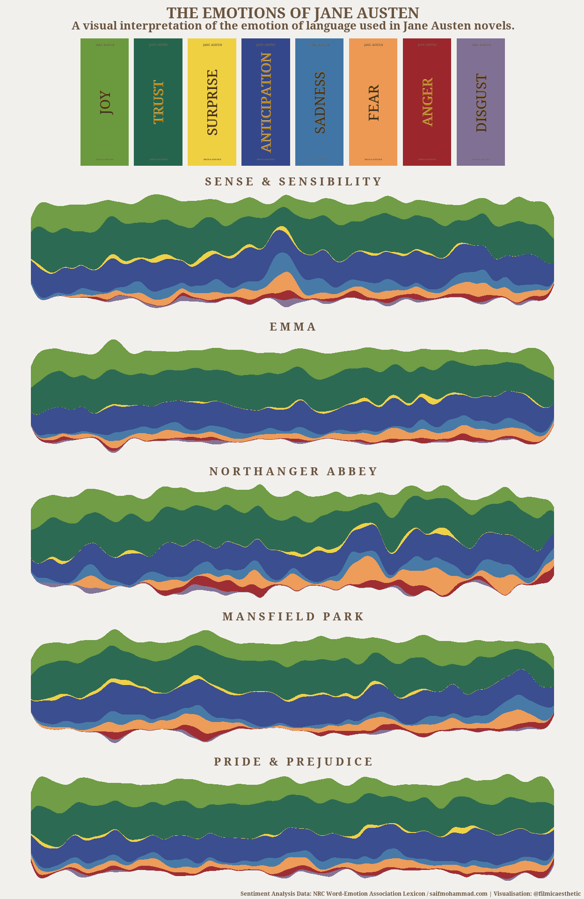

The Emotions of Jane Austen
================

This personal project explores the literature of Jane Austen novels,
provided by Julia Silge’s
<a href="https://github.com/juliasilge/janeaustenr">janeaustenr</a>
package in R, using the
<a href="https://saifmohammad.com/WebPages/NRC-Emotion-Lexicon.htm">NRC
Word-Emotion Association Lexicon</a> by Saif Mohammad. The lexicon is
used to identify words associated with a range of 8 emotions: joy,
trust, surprise, anticipation, sadness, fear, anger, and disgust.

The project aims to capture a visual interpretation of the emotional
journey in each novel with a single visualisation.

<!-- -->

## Process

-   Load the NRC Word-Emotion Association Lexicon and Jane Austen novels
    datasets and prepare for further analysis.
-   Count occurrences of words with an emotional association for each
    line of each book.
-   Group lines approximately into pages (30 lines) to help reduce noise
    in the final visualisation.
-   Identify the two emotions with strongest association for each group.
-   Plot the results for each novel in a streamgraph.
-   Create grid of all plots and bookshelf-style legend.
